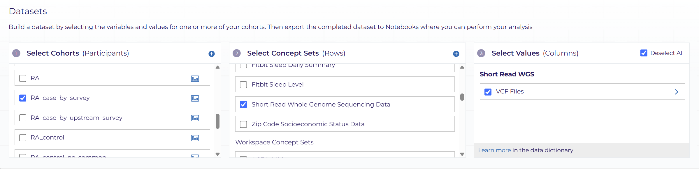

# AoU-Tutorial
A tutorial for using All of Us platform for biomedical research.

## Description and flowchart

1. **Workspace Setup**

2. **Cohort Identification**

3. **Concept Identification**

4. **Dataset creation**

5. **Data analysis (genomics environment vs standard environment)**

6. **Result storage and export**


## Method

### Step 1: Workspace Setup

#### 1. Workspace Fundamentals  
- **What is a Workspace?**  
  A cloud-based environment in AoU Researcher Workbench where you create, save, and run all analyses.  
- **Key Actions on Creation:**  
  1. **Name & Discribe** your workspace, more details can be found in [Writing Your Workspace Description](https://support.researchallofus.org/hc/en-us/articles/30351591538580-Writing-Your-Workspace-Description)
  2. **Select Data Access Tier:** [Registered Tier](https://docs.google.com/document/d/158NTVpz1qJeA3_DTKAvR30XBEYhXPNqhnVQNRgK1FQM/edit?tab=t.0#heading=h.e7ppu6uf0bea) or [Control Tier](https://docs.google.com/document/d/1F3hxRgTgGc4nfQMNrsAuKwigozMKKFnV-7gU83LfI8g/edit?tab=t.0#heading=h.e7ppu6uf0bea) 
  3. **Select CDR Version** — the curated data repository (CDR) holds all current AoU research data and is updated periodically (The latest version is [CDRv8](https://support.researchallofus.org/hc/en-us/articles/30294451486356-Curated-Data-Repository-CDR-version-8-Release-Notes))
  4. **Select Billing Account** — for more details on initial credits and billing setup, see “[Paying for Your Research](https://support.researchallofus.org/hc/en-us/sections/360007074491-Paying-for-Your-Research)”


#### 2. Versioning & Duplication  
- **Why CDR Versioning Matters:**  
  - Ensures your results reference a fixed data snapshot.  
  - Enables others (and future you) to rerun analyses on the identical dataset.  
- **Updating Your Data:**  
  - When a new CDR is released, simply [duplicate](https://support.researchallofus.org/hc/en-us/articles/30328097309332-Managing-Workspaces) your existing workspace to inherit updated research data while preserving your original code and outputs.  


#### 3. Sharing & Collaboration  
- **Shared Workspace:**  Users are allowed to [share](https://support.researchallofus.org/hc/en-us/articles/30328097309332-Managing-Workspaces?utm_source=chatgpt.com) their workspace to other registered collaborators
  - including following assets: **Cohorts**, **Concept Sets**, **Datasets**, **Analysis Code**
- **Featured Workspaces:** The platform provide some example workspaces could be used as templets. More information can be found in [featured workspace](https://support.researchallofus.org/hc/en-us/articles/360059633052-Featured-Workspaces). Moreover, users are allowed to [publish](https://support.researchallofus.org/hc/en-us/articles/24058730663828-Publishing-your-workspace-as-a-Community-Workspace-in-the-Researcher-Workbench?utm_source=chatgpt.com) their workspace to as a Community Workspace.


#### 4. Data Type

| Data Modality        | Key Contents                                                             | Standard Vocabulary & [OMOP Domain](https://support.researchallofus.org/hc/en-us/articles/360039585391-Understanding-OMOP-Basics)                                | Explore Link                                                                                                                                          |
|----------------------|---------------------------------------------------------------------------|------------------------------------------------------------------|-------------------------------------------------------------------------------------------------------------------------------------------------------|
| **EHR**              | conditions, drug exposures, labs and measurements, and procedures         | Domine(e.g. Conditions) → Source Vocabulary (e.g. ICD-9,ICD-10) → OMOP Standard Vocabulary (e.g. SNOMED) | [Introduction to All of Us Electronic Health Record (EHR) Collection and Data Transformation Methods](https://support.researchallofus.org/hc/en-us/articles/30125602539284-Introduction-to-All-of-Us-Electronic-Health-Record-EHR-Collection-and-Data-Transformation-Methods)  |
| **Surveys**    | Self-reported demographics, lifestyle, social determinants, COVID-19      | Survey questions and answers → PPI (All of Us) →  OMOP Standard Vocabulary (SNOMED, LOINC, PPI)      | [Introduction to All of Us Survey Collection and Data Transformation Methods](https://support.researchallofus.org/hc/en-us/articles/6085114880148-Introduction-to-All-of-Us-Survey-Collection-and-Data-Transformation-Methods))   |
| **Physical Measures**| Blood pressure, heart rate, height, weight, waist circumference           | Program physical measurements → PPI (All of Us) →  OMOP Standard Vocabulary (SNOMED, LOINC, PPI)  | [Introduction to All of Us Physical Measurement Data Collection and Transformation Methods](https://support.researchallofus.org/hc/en-us/articles/29888188023060-Introduction-to-All-of-Us-Physical-Measurement-Data-Collection-and-Transformation-Methods) |
| **Genomics**         | SNV/Indel calls, WGS reads, genotyping arrays                            |                                               | [Genomics](https://support.researchallofus.org/hc/en-us/articles/29475228181908-How-the-All-of-Us-Genomic-data-are-organized)|
| **Wearables**        | Activity metrics, sleep patterns, out-of-clinic heart rate               |                                               | [Fitbit Data](https://support.researchallofus.org/hc/en-us/articles/20281023493908-Resources-for-Using-Fitbit-Data)   |
- For more detaisl:
  - [Data Browser](https://support.researchallofus.org/hc/en-us/articles/6088666015636-The-All-of-Us-Data-Browser-Tutorial): preview aggregate counts and distributions across domains  
  - [Data Dictionaries](https://support.researchallofus.org/hc/en-us/articles/360033200232-Data-Dictionaries) & [Codebooks](https://support.researchallofus.org/hc/en-us/articles/360051991531--All-of-Us-Survey-Codebooks):  
    - The CDR Data Dictionaries offer a complete, versioned listing of all metadata for every table and field in the All of Us CDR
    - The Survey Codebooks compile all fielded survey instruments (Baseline, Follow-Up, PPI) into a tabbed document. Each tab corresponds to one survey, listing every question, response code, value labels, and tier-specific privacy rules

---

### Step 2: Cohort Identification

#### 1. What Is a Cohort?  
A **cohort** is the set of participants you’ll analyze, defined by inclusion and exclusion criteria that reflect your study question.

#### 2. Inclusion & Exclusion Logic  
- **Inclusion Groups** (`Group 1`, `Group 2`, …) use **OR** within each group (any criterion) and **AND** across groups (all groups must be met).  
- **Exclusion Group** (`Group X`) removes anyone who meets *any* exclusion criterion, even if they satisfy inclusion.


#### 3. Building Your Cohort  
1. Open your workspace and click **Cohorts** block.  


2. Click **Add Inclusion Criteria**: search by keyword (e.g. “diabetes”) or enter concept codes (ICD-9/10, SNOMED, CPT).  
3. (Optionally) Click **Add Another Group** to layer additional inclusion logic.  
4. (Optionally) Click **Add Exclusion Criteria** to remove participants (e.g. comorbidities).  
5. Preview the cohort size; adjust criteria or operators until you reach your target population.  
6. Click **Save** and give your cohort a clear, versioned name (e.g. `RA_case_by_survey`).
> See [Selecting Participants Using the Cohort Builder](https://support.researchallofus.org/hc/en-us/articles/360039585591-Selecting-Participants-Using-the-Cohort-Builder) for more detailed instructions

#### 4. Example: RA Case–Control  
- **RA Cases**: answered “Yes” to the RA follow-up survey question ("*Are you still seeing a doctor or healthcare provider for rheumatoid arthritis (RA)?*").  
- **RA Controls**: never saw a provider for RA AND no RA-related EHR codes AND no major comorbidities (CVD, diabetes, hypertension).  
- **Result**: 3,879 cases and 144,419 controls initially; refined by age (25–105 in 10-year bins) to 14,943 controls.

**The following picture shows RA Control Cohort example**.  


#### 5. Advanced Tips  
- **[Cohort Review](https://support.researchallofus.org/hc/en-us/articles/360039585651-Reviewing-Participants-with-the-Cohort-Review)**: use the review tab to inspect sample records before finalizing. 
- **[Temporal Filter](https://support.researchallofus.org/hc/en-us/articles/19012423801364-Using-the-Temporal-Feature-within-the-Cohort-Builder)**: add date ranges (e.g. “first RA code in last 5 years”).    

---

### Step 3: Concept Identification

#### 1. What Is a Concept Set?
A **concept** in All of Us is a standardized medical term or code (e.g., SNOMED, ICD-10, LOINC) used to represent clinical events, measurements, or survey items. You group these into **concept sets** to specify exactly which data elements you want to retrieve for your analyses. Concept identification ensures that you’re pulling the correct, standardized items across diverse vocabularies, and lets you reuse and version your definitions for transparency and reproducibility.

#### 2. Building Your Concept Sets
1. Open your workspace and click **Datasets** block to launch the Dataset Builder.


2. Click the button to the right of the **Select Concept Sets** pane.


3. Enter keywords, concept names, or codes to search across all domains and vocabularies.
4. Toggle **Show source concepts** to include non-standard codes (ICD, CPT, etc.) alongside standard concepts.
5. Click each concept to add it to your set; group related concepts (e.g., all RA diagnostic codes) into one set for clarity.

> See [Building a Dataset with the Dataset Builder](https://support.researchallofus.org/hc/en-us/articles/4556645124244-Building-a-Dataset-with-the-Dataset-Builder) for more detailed instructions

#### 3. Applying Concept Sets in Analyses
Once created, your concept sets appear as reusable assets:
- **In Cohort Builder**, reference concept sets directly when defining inclusion or exclusion criteria.
- **In Notebooks or SQL**, retrieve the `concept_set_id` and join the `concept_set_item` table with the appropriate data table to pull participant-level data.

##### Example SQL Snippet
```sql
-- Retrieve all measurements for your concept set
SELECT
  m.person_id,
  m.measurement_date,
  m.value_as_number
FROM
  `{{WORKSPACE_CDR}}.measurement` AS m
JOIN
  `{{WORKSPACE_CDR}}.concept_set_item` AS csi
ON
  m.measurement_concept_id = csi.concept_id
WHERE
  csi.concept_set_id = 12345;
```
Replace `measurement` with the appropriate table (e.g., `condition_occurrence`, `drug_exposure`) and `12345` with your actual `concept_set_id`.
> See [Exploring Concepts with OMOP and SQL](https://support.researchallofus.org/hc/en-us/articles/360039585491-Exploring-Concepts-with-OMOP-and-SQL) for more examples

#### 4. Example: RA Case–Control
- **RA_survey**: Survey question related to the diagnosis of RA
  - About how old were you when you were first told you had rheumatoid arthritis (RA)?
  - Are you currently prescribed medications and/or receiving treatment for rheumatoid arthritis (RA)?
  - Are you still seeing a doctor or health care provider for rheumatoid arthritis (RA)?
  - Including yourself, who in your family has had rheumatoid arthritis (RA)? Select all that apply.


- **RA_condition**: RA case identified by condition code (ICD9/ICD10)
  - Other specified rheumatoid arthritis
  - Rheumatoid arthritis
  - Rheumatoid arthritis without rheumatoid factor
  - Rheumatoid arthritis, unspecified


---

### Step 4: Dataset Creation

#### 1. What Is a Dataset?
A dataset in All of Us is a structured table of participant-level records built from one or more concept sets and your predefined cohort. It lets you package exactly the variables you need—across EHR, survey, genomics or wearable domains—and export them for downstream analysis in Jupyter or RStudio.

#### 2. Building a Dataset
1. Open the **Datasets Builder** in your workspace
2. In the **Select Cohorts** panel, choose the cohort you defined in Step 2
3. In the **Select Concept Sets (Rows)** panel, add one or more of your saved concept sets
4. In the **Select Values (Columns)** panel, check values you want
5. Click **View Preview Table** to see the first 100 rows of your dataset
6. Click **CREATE DATASET** button at the bottom, and enter a **Name** and **Description** for your dataset
7. After the Dataset is created, Click **Analyze** to open the **Export Dataset** dialog, where you can choose R, Python, or SAS export and either send code directly into a new/existing notebook or copy it for use in your preferred IDE
> See [Building a Dataset with the Dataset Builder](https://support.researchallofus.org/hc/en-us/articles/4556645124244-Building-a-Dataset-with-the-Dataset-Builder) for more detailed instructions

> If you’re comfortable with SQL, you can bypass the visual builders and write your own queries directly in a notebook, though the Dataset Builder is recommended for most users (e.g. [Retrieve EHR Record](Code/Retrieve_ehr.py), [Retrieve Survey Record](Code/Retrieve_survey.py))

#### 3. Example: RA Case-Control
| Dataset Name               | Group      | Cohort              | Concept Sets  |
|----------------------------|-----------:|--------------------:|--------------:|
| **RA_survey_condition**    |  Case      |RA_case_by_survey    | Demographics, RA_condition, RA_survey |
| **RA_control_no_common**   |  Control   |RA_control_no_common | Demographics, RA_survey    |
> See [00_AoU_generated_code](data_preparation/00_AoU_generated_code.ipynb) for AoU auto-generated notebook export code

#### 4.(optional) Genomic Data

- **Prerequisite:**
  * **Use only for cohorts < 5000 participants.** 

- **Extraction Steps**
  1.  **Dataset Builder**:
      * Select your cohort.
      * Check prepackaged concept sets for WGS data.
      * Choose `VCF files`.
  
  
  2.  Click **CREATE DATASET**, name it, and save.
  3.  Click **ANALYZE**, then **EXTRACT & CONTINUE**.
> See [using the Genomic Extraction tool](https://support.researchallofus.org/hc/en-us/articles/4558187754772-Selecting-Genomic-data-using-the-Genomic-Extraction-tool) for more instructions

- **After Extraction**
  * You will be notified when the background job is complete.
  * Export the dataset to a **Python** Jupyter Notebook to access the analysis tools.

- **Sample Extraction Code**:
  - [02_RA_case_genomics_extraction.ipynb](data_preparation/02_RA_case_genomics_extraction.ipynb)

- **For large Cohort( > 5000)**:
  - In the case study, the RA_control_no_common dataset is divided into **four subsets** to satisfy the prerequiste of cohort size.
  - Extraction code:
    - [03_RA_control_genomics_extraction.ipynb](data_preparation/03_RA_control_genomics_extraction.ipynb)
    - **Alternatively**, you can access genomic data directly in jupyter notebook, see [How to Work with All of Us Genomic Data (Hail - Plink)(v8)](https://workbench.researchallofus.org/workspaces/aou-rw-a5b0235e/howtoworkwithallofusgenomicdatahailplinkv8/data) and [03_Manipulate Hail MatrixTable](https://support.researchallofus.org/hc/en-us/articles/4558187754772-Selecting-Genomic-data-using-the-Genomic-Extraction-tool) for instrctions
---

### Step 5: Data Analysis (Standard vs. Genomics Environment)
All of Us provides several cloud environments for data analysis, including Jupyter, R, and SAS. It is recommended to first export data to a **Jupyter Notebook**, where you can prepare and process the data, then store it in a Google Cloud Storage(GCS) for downstream analysis in other cloud environments.

#### 1. Standard vs. Genomics Environments 
- **General Analysis Environment**:     
  - Ideal for regular jobs, like phenotypic data exploration
- **Hail Genomics Analysis**:
  - Dataproc Cluster computing type is automatically created
  - Pre-installed libraries for Hail, Spark, and bioinformatics tools  
  - Optimized for analysis on WGS data

#### 2. Launching Your Notebook
1. In Workbench, select **Jupyter Cloud Envirnoment** on the right handside of the screen.  
2. Instead the **Recommend Envirnoments**, choose **General Analysis Environment** or **Hail Genomics Analysis**
3. **Configure** CPU, RAM, disk, and the number of workers according to the requirements
4. Click **Next** on the bottom of the panel
> [Video instruction](https://support.researchallofus.org/hc/en-us/articles/32519872019220-Customizing-Jupyter-Notebook-Environments)

#### 3. Accessing Your Dataset  
1. After completing step 4, you can locate your dataset in the **Datasets** section as illustrated below:

2. Select the dataset you wish to analyze and export it to your chosen Jupyter notebook.
3. (optional)  If you select the GWAS concept, you can find the path to the extracted VCF files by following [guidance](https://support.researchallofus.org/hc/en-us/articles/4558187754772-Selecting-Genomic-data-using-the-Genomic-Extraction-tool)

#### 4. Example Analysis Workflows  
| Environment  | Focus                                  | Sample Notebooks                                               |
|-------------:|----------------------------------------|----------------------------------------------------------------|
| **Standard** | Cohort tables, EHR/survey summaries    | [RA_phenotypic](data_preparation/00_AoU_generated_code.ipynb)            |
| **Genomics** | Variant QC, PCA, regression on SNPs   | [RA_case_genomics](data_preparation/02_RA_case_genomics_extraction.ipynb)            |

#### 5. Other Applications
- RStudio: Full-featured R IDE for statistical modeling and graphics
- SAS Studio: SAS language interface optimized for large dataset handling and advanced statistical analyses
- Cromwell (WDL): Managed WDL workflows via Google Batch API, supporting complex bioinformatics pipelines
> See [Using Workspaces, Cloud Environments, and Applications](https://support.researchallofus.org/hc/en-us/sections/6000139724820-Using-Workspaces-Cloud-Environments-and-Applications) for more details
---

### Step 6: Result storage and export
#### Storage Options
All of Us Researcher Workbench offers multiple storage layers. Choose the right one for your use case:

| Storage Option       | Location                                               | Persistence                            | Shared?                                 | [Access Methods](https://support.researchallofus.org/hc/en-us/articles/22465609082260-Accessing-Files-in-the-Workspace-Bucket-or-Persistent-Disk)                                             | Notes                                                                                                               |
|----------------------|--------------------------------------------------------|----------------------------------------|-----------------------------------------|------------------------------------------------------------|---------------------------------------------------------------------------------------------------------------------|
| **Workspace Bucket** | Google Cloud Storage bucket attached to your workspace | Permanent: lives until workspace is deleted| Yes: auto-shared with collaborators | - Jupyter/RStudio file browser<br>- `gsutil ls $WORKSPACE_BUCKET`   | Ideal for long-term artifacts (scripts, summary tables, figures).     |
| **Persistent Disk**  | VM’s attached persistent disk (PD)                     | Permanent: survives VM stop/delete | No: private to you  | - VM home directory (e.g., `/home/jupyter`)<br>- Python `.to_csv()`, `.to_pickle()` | Use for software installs, config files, large intermediate data; incurs GCP storage costs.       |
| **Standard Disk**    | Ephemeral disk in Dataproc cluster environments        | Temporary: lives only with cluster       | No: isolated to that cluster          | - Dataproc notebook terminal<br>- HDFS or local shell commands              | Dataproc clusters do **not** support persistent disks; copy outputs to workspace bucket before cluster deletion.    |
> **Source:** [“Storage Options Explained”](https://support.researchallofus.org/hc/en-us/articles/5139846877844-Storage-Options-Explained), All of Us Support, updated May 14, 2025.
 


